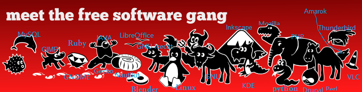

### part1

##### 1-1

可移植性指的是某个程序若要移植到其他环境中去时，只需要调整为数不多的代码即可，而无需全部重写。

对于操作系统来说的可以移植性，指的是该操作系统在移植到不同硬件环境时，只需要调整为数不多的代码，系统就可以跑在新的硬件环境上。

对于CPU架构而言，RISC和CISC的最大区别在于指令集不同。

而以C编写的操作系统，通过调整编译器对应的指令集，更换底层库，就能实现操作系统的迁移。


##### 1-2

相同之处

1. 都存在程序与内核

不同之处

1. windows可移植性差（虽然现在也出现了跑在arm上的windows-x）
2. unix将装置和进程间通信当成文件，而windows则不
3. windows的管道概念有，但好像不如unix的管道出名（虽然powershell现在也存在管道的而实用）

##### 1-3

我觉得KISS原则今天在程序开发上还适用。程序的本质是为了减少重复的工作，实现更多的功能。对于用户来说，简单的程序能降低学习成本，无需考虑程序其中是如何实现的；对于程序员来说，保持程序整洁可阅读、保持程序条理清晰相对朴素，对于团队协作、代码重构、实现功能也有好处。

##### 1-4

采用的是Apache协议，因为根据规定在其衍生的代码中需要带有原来代码中的协议

##### 1-5

[microsoft/vscode: Visual Studio Code (github.com)](https://github.com/microsoft/vscode)是一款微软起头编写的编辑器，其

采用的许可证为MIT License

##### 1-6



##### 1-7

Linux是操作系统，它是基于Linux内核和一众GNU元件构成的GUN/Linux操作系统。

##### 1-8

虚拟机技术是一种模拟技术，它使用宿主机的硬件资源，来模拟特定的操作系统，进而提供特定的功能

---

### part2

##### 2-1

两者值不一样。因为一个是从终端启动的non-login  Shell，一个是用户shell

##### 2-2

例如可以使用 `export MY_VALUE=13555`，或者将已经设置好的变量`MY_VALUE`使用`export MY_VALUE`。

其定义的变量作用范围仅限于该次登陆。

##### 2-4

```shell
sudo useradd dino
sudo passwd dino
sudoedit /etc/sudoers

#添加一行 dino	ALL=(ALL:ALL) ALL
```


##### 2-5

passwd文件中每一行代表一个用户，以冒号分成七格分别是，账户名称、密码占位、UID、GID、账户附加基本信息、Home目录、登录Shell


##### 2-6

xterm可以用来模拟终端，它依赖于以下包

- libc6 (>= 2.15) [amd64, s390x]
- libfontconfig1 (>= 2.12.6)
- libfreetype6 (>= 2.2.1)
- libice6 (>= 1:1.0.0)
- libtinfo6 (>= 6)
- libutempter0 (>= 1.1.5)
- libx11-6
- libxaw7
- libxext6
- libxft2 (>> 2.1.1)
- libxinerama1
- libxmu6
- libxpm4
- libxt6
- xbitmaps


##### 2-7

main：官方支持维护、免费开源，Ubuntu官方在每个版本的声明周期里会维护安全补丁和修复补丁。Vim就是一个例子

Restricted：官方支持、闭源，由软件提供商进行维护的设备专有驱动。比如NVIDIA的图形驱动程序。

Universe：社区维护、免费开源。比如VScode

Multiverse：有版权和合法性问题的软件。 比如rar

Partner：与Canonical合作的软件仓库，免费、闭源。比如Adobe Flash


##### 2-8

`../ 此处省略2n-2 个.. /..`

##### 2-9

`ls -d .*`

##### 2-10

`ls *.conf`

##### 2-11

b表示块设备，提供数据存储，比如硬盘

c表示字符设备，比如键鼠打印机。

